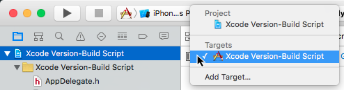

# Xcode Version-Build Script
Adding this script to your project turns the Version and Build numbers from this...


...to this...


...when building or archiving.
##Installing the Script
To install the script select the project's target.



Click the ```Build Phases``` tab. If you don't see the ```Run Script``` section click ```+``` in the Standard Editor's top left corner and select ```New Run Script Phase``` in the popup menu.


Expand the ```Run Script``` section. Verify that ```/bin/sh``` is in the ```Shell``` text field. Replace the ```Type a script or drag a script file from your workspace to insert its path``` sentence with the contents of the ```Xcode Version-Build Script.txt```. The ```Run Script``` section should look like the following. (Well, not quite. The script may have been updated in which case I'm not going to do a new screen shot with the new version.)


When you build the app for the simulator or a device the build number will be incremented. When you archive the app for iTunes Connect or Enterpirse Distribution the Version number will be incremented (1.0 &#8658; 1.1) and the build number will be reset to 0.

***One caveat***. The Version and Build numbers are incremented **after** the build or achive. Begin your new project with Build 0. 


##Using Version & Build Numbers in Code
###Objective-C

```
self.lblVersion.text = [NSString stringWithFormat:@"Version: %@", [[NSBundle mainBundle] objectForInfoDictionaryKey:@"CFBundleShortVersionString"]];

self.lblBuild.text = [NSString stringWithFormat:@"Build: %@", [[NSBundle mainBundle] objectForInfoDictionaryKey:@"CFBundleVersion"]];
```
###Swift
```
self.lblVersion.text = String(format: "Version: %@", (NSBundle.mainBundle().infoDictionary?["CFBundleShortVersionString"] as? String)!);

self.lblBuild.text = String(format: "Build: %@", (NSBundle.mainBundle().infoDictionary?["CFBundleVersion"] as? String)!);
```
##License
The MIT License (MIT)

Copyright (c) 2015 Daniel J. Pinter

Permission is hereby granted, free of charge, to any person obtaining a copy of this software and associated documentation files (the "Software"), to deal in the Software without restriction, including without limitation the rights to use, copy, modify, merge, publish, distribute, sublicense, and/or sell copies of the Software, and to permit persons to whom the Software is furnished to do so, subject to the following conditions:

The above copyright notice and this permission notice shall be included in all copies or substantial portions of the Software.

THE SOFTWARE IS PROVIDED "AS IS", WITHOUT WARRANTY OF ANY KIND, EXPRESS OR IMPLIED, INCLUDING BUT NOT LIMITED TO THE WARRANTIES OF MERCHANTABILITY, FITNESS FOR A PARTICULAR PURPOSE AND NONINFRINGEMENT. IN NO EVENT SHALL THE AUTHORS OR COPYRIGHT HOLDERS BE LIABLE FOR ANY CLAIM, DAMAGES OR OTHER LIABILITY, WHETHER IN AN ACTION OF CONTRACT, TORT OR OTHERWISE, ARISING FROM, OUT OF OR IN CONNECTION WITH THE SOFTWARE OR THE USE OR OTHER DEALINGS IN THE SOFTWARE.